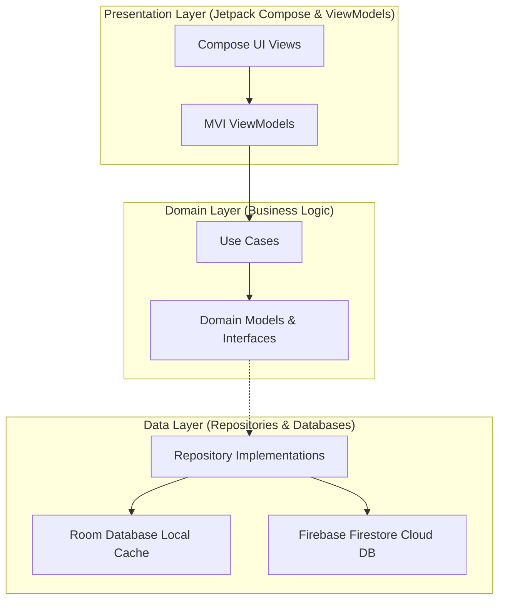

# BioMedTrack

BioMedTrack is a real-time, multi-user medical equipment tracking and maintenance management Android application designed for hospital environments. It replaces manual logs and fragmented spreadsheets with a digital system that tracks machine health, automates maintenance reminders, schedules technician assignments, and handles photo documentation across 22+ hospital departments.

---

## 🚀 Key Features

*   **Real-Time Sync & Offline-First**: Utilizes Firebase Firestore as a real-time remote source of truth, combined with Room Database local cache to allow technicians to view, update, and search inventory offline.
*   **Role-Based Access Control (RBAC)**: Custom permissions partitioned across three roles:
    *   **Technician**: View inventory, log service work, view scheduler, and export department-filtered reports.
    *   **Supervisor**: Add/edit/delete equipment, assign tasks, and generate overall reports.
    *   **Admin**: Full system access, importing equipment sheets, and managing user profiles.
*   **Interactive Maintenance Logging & Photo Pipelines**: 10-point checklist enforcement for safety, integrated photo capture with Firebase Storage uploading, and transactional equipment status logging.
*   **Precision Scheduling Calendar**: Week-view task calendar displaying scheduled preventive maintenance alerts mapped by UNIX milliseconds.
*   **Media & Report Generators**: Programmatic on-device PDF generation (via iText 7) and Excel sheets creation (via Apache POI) streamed directly to Android's `MediaStore` Downloads directory.
*   **Comprehensive Localization (English & Arabic RTL)**: Full support for English and Arabic layouts, RTL layout direction mirror adjustments, and custom Arabic Quantity Strings (`<plurals>`) relative timestamp formatting.

---

## 🏛 Clean Architecture Blueprint

The project is structured strictly in three layers, ensuring code is testable, decoupled, and easy to maintain:



### Architectural Conventions
*   **MVI State Hoisting**: Single source of truth for UI states is hoisted into ViewModels via `MutableStateFlow` to ensure persistence and prevent input resetting during configuration/keyboard changes.
*   **Fluid Dimensioning**: Component wrappers use dynamic dimension modifiers (e.g., `fillMaxWidth()`, `weight()`, `heightIn()`) rather than hardcoded dimensions to prevent clipping when text scales or when RTL mirror transforms occur.

---

## 📊 Database & Data Schemas

### Cloud Schema (Firestore)
*   `/users/{userId}`: User profiles, roles, and assigned department access metadata.
*   `/equipment/{equipmentId}`: Tech specifications, status, and maintenance history references.
*   `/maintenanceLogs/{logId}`: Service logs, safety check results, and photo storage URLs.
*   `/statusChangeLogs/{logId}`: Chronological status logs recording change actors, previous states, and times.
*   `/tasks/{taskId}`: Technician assignments and scheduled maintenance tasks.

---

## 🛠 Tech Stack

*   **UI Framework**: Jetpack Compose, Material 3, Compose Navigation.
*   **Dependency Injection**: Hilt.
*   **Concurrency**: Kotlin Coroutines & Flows (reactive flow combining).
*   **Database**: Room Database (Local cache), Firebase Firestore (Cloud Database).
*   **Authentication & Media**: Firebase Authentication, Firebase Storage.
*   **Network**: Ktor HTTP Client (CIO engine).
*   **Report Generation**: iText 7 (PDF Engine), Apache POI (Excel Generator).

---

## 🛠 Setup & Installation Guide

### Prerequisites
*   Android Studio Ladybug or newer.
*   JDK 11+.
*   A Firebase Project initialized with Firestore, Firebase Auth, and Firebase Storage enabled.

### 1. Firebase Integration
1.  Register your Android app in your Firebase Console using package: `com.riramzy.biomedtrack`.
2.  Download the generated `google-services.json` and place it in the `app/` folder.
3.  Place your Firebase Service Account private key in `app/src/main/assets/fcm_service_account.json` (ensure this file remains ignored in `.gitignore`).

### 2. Gradle Build Command
Build the debug assembly to generate the Hilt component bindings:
```bash
./gradlew assembleDebug
```

### 3. Run Unit Tests
Run the project's test suites (Uses JUnit 4, MockK, and Turbine):
```bash
./gradlew test
```
